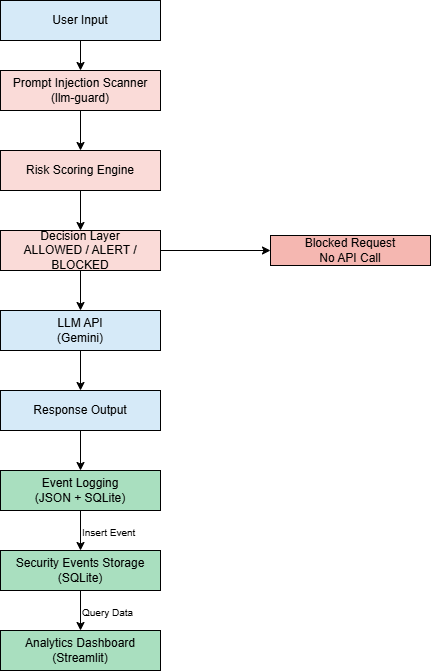

# 🛡️ AI Security Monitoring System

An AI-powered security system that detects prompt injection attacks and monitors interactions through structured logging and analytics.

---

## 🚀 Overview

This project focuses on **AI safety and security**, specifically detecting prompt injection attacks in LLM-based systems.

In addition, it includes a lightweight **data pipeline and monitoring layer**, where all interactions are logged, stored, and analyzed through a dashboard.

The goal is to combine:

* 🤖 AI interaction (LLM-based chatbot)
* 🔐 Security (prompt injection detection)
* 📊 Monitoring & analytics (dashboard + logs)

## 🧠 Key Features

* 🔍 Prompt Injection Detection using `llm-guard`
* 📊 Real-time analytics dashboard with Streamlit
* 🧾 Structured JSON logging (event-based)
* 🗄️ SQLite database for persistent storage
* 📈 Risk scoring and monitoring over time
* 📥 CSV export for data analysis

---

## 🏗️ Architecture



---

## 📂 Project Structure

```
AI-SECURITY-PROJECT/
│
├── guard.py              # Main chatbot + pipeline logic
├── secure_chat.py        # Streamlit dashboard
├── dashboard.py          # (legacy dashboard)
├── requirements.txt
├── requirements_app.txt
├── security_audit.jsonl  # JSON event logs
├── security_events.db    # SQLite database
├── Dockerfile
└── .gitignore
```

---

## ⚙️ Installation

### 1. Clone the repository

```
git clone https://github.com/your-username/AI-SECURITY-PROJECT.git
cd AI-SECURITY-PROJECT
```

### 2. Install dependencies

```
pip install -r requirements.txt
```

### 3. Set environment variable

Create a `.env` file:

```
GEMINI_API_KEY=your_api_key_here
```

---

## ▶️ Run the Project

### Run the chatbot

```
python guard.py
```

### Run the dashboard

```
streamlit run secure_chat.py
```

---

## 🐳 Docker (Optional)

```
docker build -t ai-security-project .
docker run -p 8501:8501 ai-security-project
```

---

## 📊 Example Data

Each user request is stored as a structured event:

```json
{
  "timestamp": "2026-03-31 15:10:00",
  "status": "ALLOWED",
  "risk_score": 0.02,
  "prompt": "hello",
  "response": "Hi!",
  "model": "gemini",
  "source": "cli_chatbot"
}
```

---

## 🔐 Security Focus

This project demonstrates:

* Input validation for LLM systems
* Detection of prompt injection attempts
* Monitoring and auditing of AI interactions

---

## ☁️ Data Engineering Perspective

This system simulates a:

* Data ingestion pipeline (user input)
* Transformation layer (risk scoring)
* Storage layer (JSON + SQLite)
* Analytics layer (dashboard)

---

## 📌 Future Improvements

* Cloud storage (AWS S3 / GCP)
* Real-time streaming (Kafka)
* Authentication system
* Advanced anomaly detection

